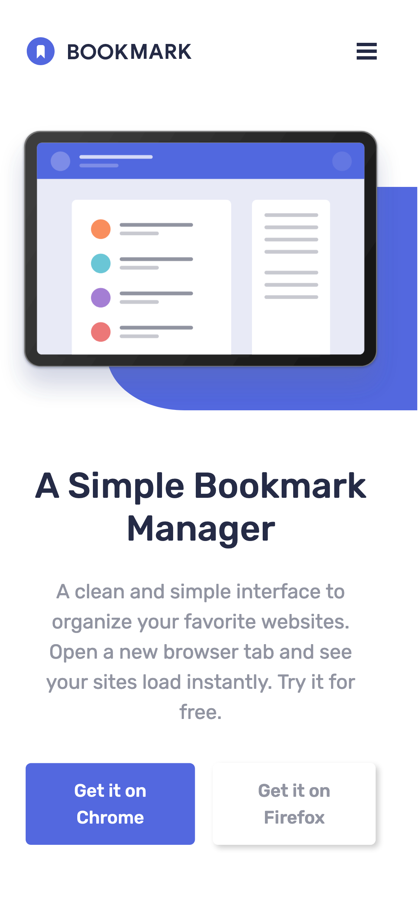
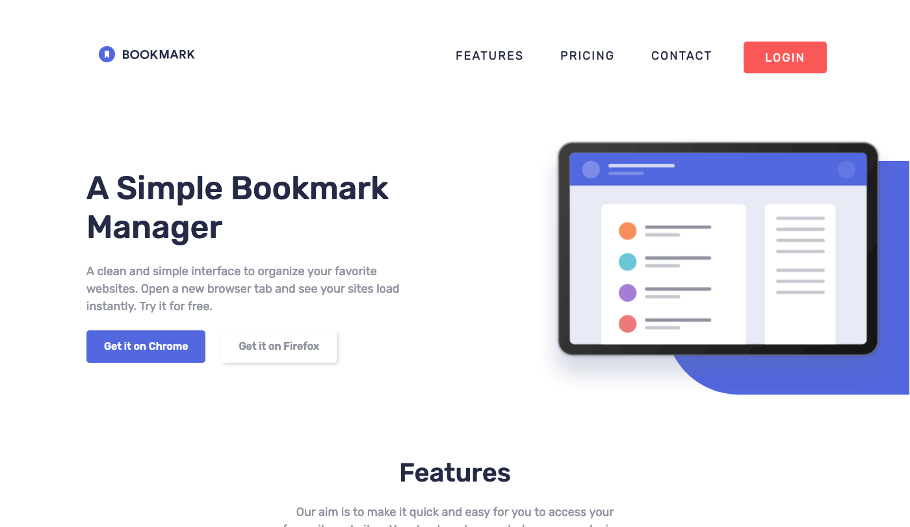

# Frontend Mentor - Bookmark Landing Page Solution

This is a solution to the [Bookmark landing page challenge on Frontend Mentor](https://www.frontendmentor.io/challenges/bookmark-landing-page-5d0b588a9edda32581d29158). Frontend Mentor challenges help you improve your coding skills by building realistic projects. 

## Table of contents

- [Frontend Mentor - Bookmark Landing Page Solution](#frontend-mentor---bookmark-landing-page-solution)
  - [Table of contents](#table-of-contents)
    - [The challenge](#the-challenge)
    - [Screenshots](#screenshots)
    - [Links](#links)
    - [Built with](#built-with)
    - [What I learned](#what-i-learned)
    - [Useful resources](#useful-resources)
  - [Author](#author)

### The challenge

Users should be able to:

- View the optimal layout for the site depending on their device's screen size
- See hover states for all interactive elements on the page
- Receive an error message when the newsletter form is submitted if:
  - The input field is empty
  - The email address is not formatted correctly

### Screenshots

 

### Links

- Solution URL: [Github Repo](https://github.com/ayearicks/Bookmark-Landing-Page)
- Live Site URL: [Live Site](https://yearicks.dev/Bookmark-Landing-Page/index.html)

### Built with

- Semantic HTML5 markup
- Bootstrap 4.5
- Jquery
- Mobile-first workflow
- Visual Studio Code
- Chrome

### What I learned

This was one of the first projects that I created using javascript. Getting the validation working on the contact form was the biggest challenge for this project. I opted to go with Jquery at the time because that was what I was studying. I'll eventually overhaul this project and use vanilla javascript, as I think I will be able to re-code this without having to call an additional outside library.

I also used multiple addClass/removeClass functions for creating the accordion effect on the FAQ section. This taught me that it's hard to chain these together but still keep the code D.R.Y.

### Useful resources

- [Bootstrap v4 Documentation](https://getbootstrap.com/docs/4.6/getting-started/introduction/) - Bootstrap has been updated to version 5 in the time since I created this landing page. But I heavily used these 4.6 documents while creating this project.
- 
- [jQuery API Docs](https://api.jquery.com/) - The standard reference for quickly looking up $jquery methods.

## Author

- Website - [Ashley Yearicks](https://yearicks.dev)
- Twitter - [@jessarin5](https://www.twitter.com/jessarin5)

